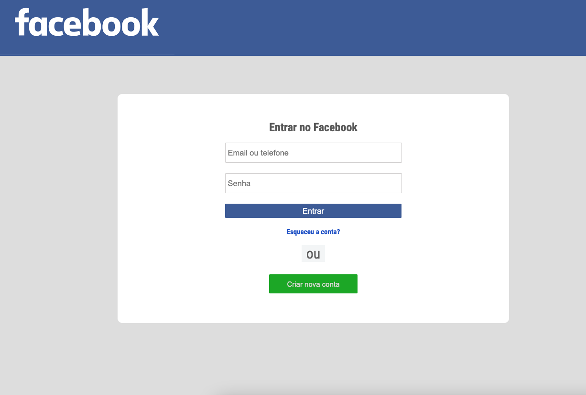

<h1 align="center">
  Tele Login Facebook
     
</h1>

<h4 align="center">
 Projeto clone da tela de login do Facebook
</h4>
 

 

  <a href="built-with">Built with</a>&nbsp;&nbsp;&nbsp;|&nbsp;&nbsp;&nbsp;
  <a href="#information_source-how-to-run">How to run</a>

  

## Built with

This project was developed with the following technologies:

-  [Html5](https://www.w3schools.com/Tags/tag_div.asp)
-  [Css3](https://www.w3schools.com/Css/css_intro.asp)
-  [VS Code](https://code.visualstudio.com/)

## information_source: How to run

# run application

Just make the clone and open in your browser :)
 

by Jorge Morais